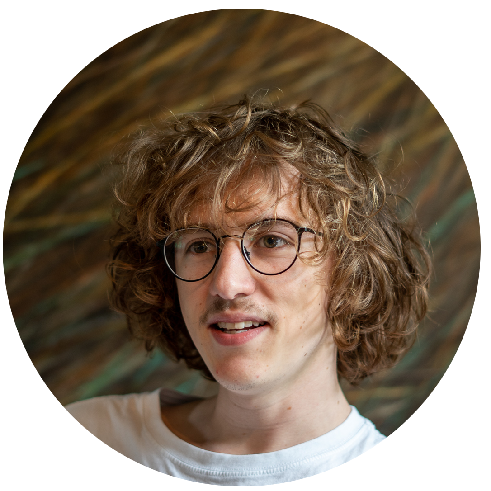

About
====================

I am a (soon-to-be) PhD student at INRIA Sophia-Antipolis in France. I will be studying Stochastic Geometry for Multiple Object Detection and Tracking in High Resolution Multi-Source Data Sets with Josiane Zerubia as my director. I graduated in 2019 from Ecole Centrale de Lille (France) in Computer Science/Machine Learning.

I also sometimes make art that may end up there [ogjee.artstation.com](https://ogjee.artstation.com)