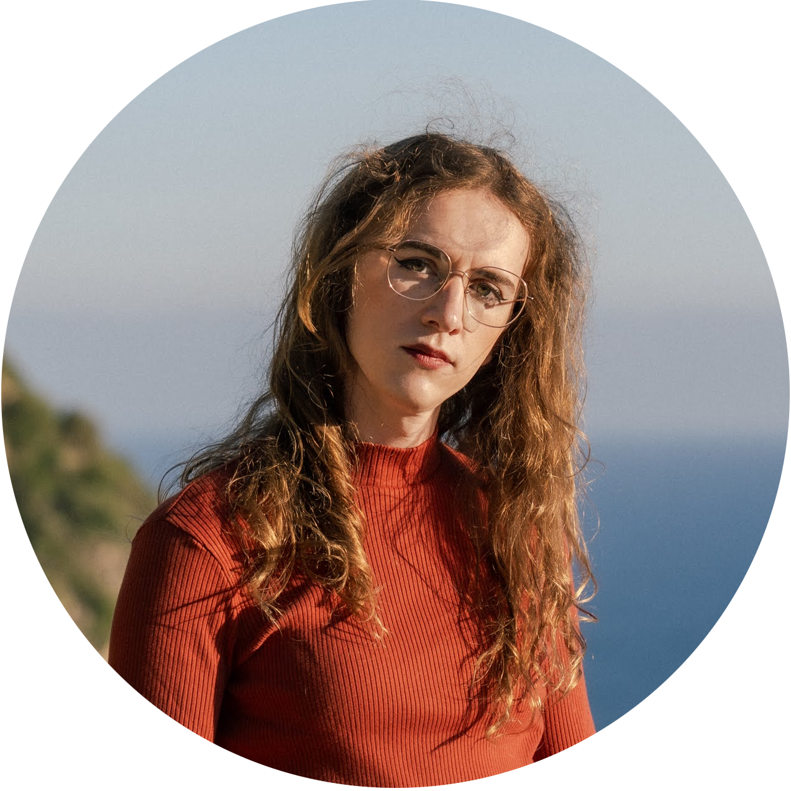

About
====================

Just defended my PhD thesis at _[Inria d'Université Côte d'Azur](https://www.inria.fr/en/inria-centre-universite-cote-azur)_ in France. I worked with [Josiane Zerubia](https://team.inria.fr/ayana/josiane-zerubia/) as my supervisor in partnership with Marthias Ortner from Airbus Defense and Space on  _Learning Stochastic geometry models and convolutional neural networks. Application to multiple object detection in high resolution data sets._

Formerly secretary of the lovely [ADSTIC](https://adstic.i3s.univ-cotedazur.fr/) (_Association Doctorale du Campus STIC_) (2022-2023).
I graduated in 2019 from _[Ecole Centrale de Lille](https://centralelille.fr)_, France, as an engineer with [specialization in Computer Science/Machine Learning](http://pierrechainais.ec-lille.fr/Centrale/Option_DAD/Accueil.html).

I am currently looking for a postdoc, preferably in the field of image analysis applied to biological imagery (feel free to contact me).

I also sometimes make art that may end up in the [**creative projects**](/crea/) section.

<!-- To be notified on future posts you can use this good old [RSS feed](/feed.xml). -->
